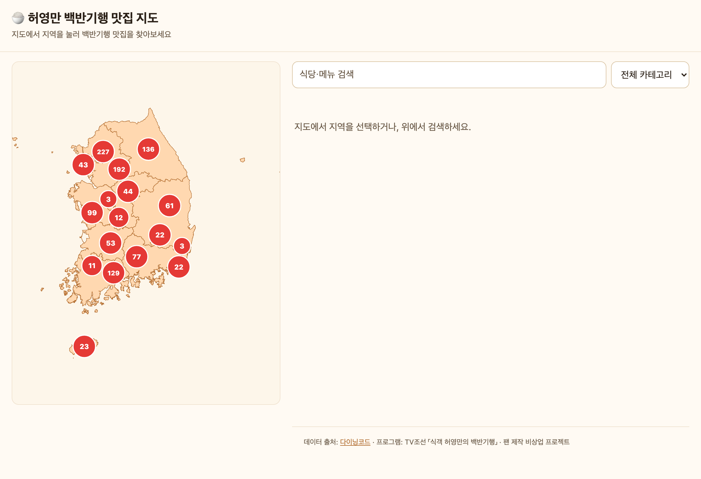
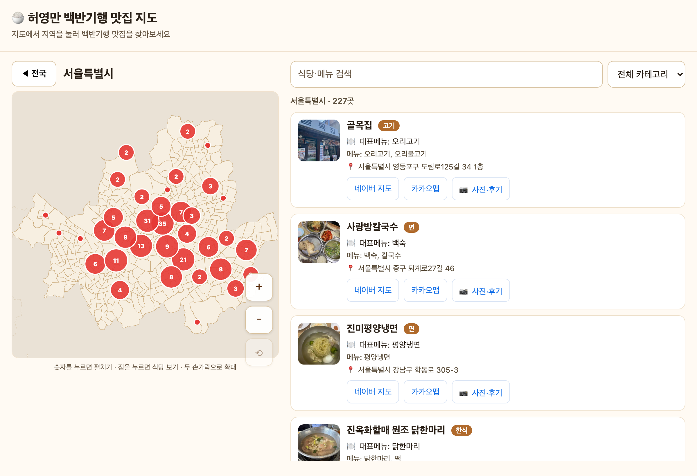
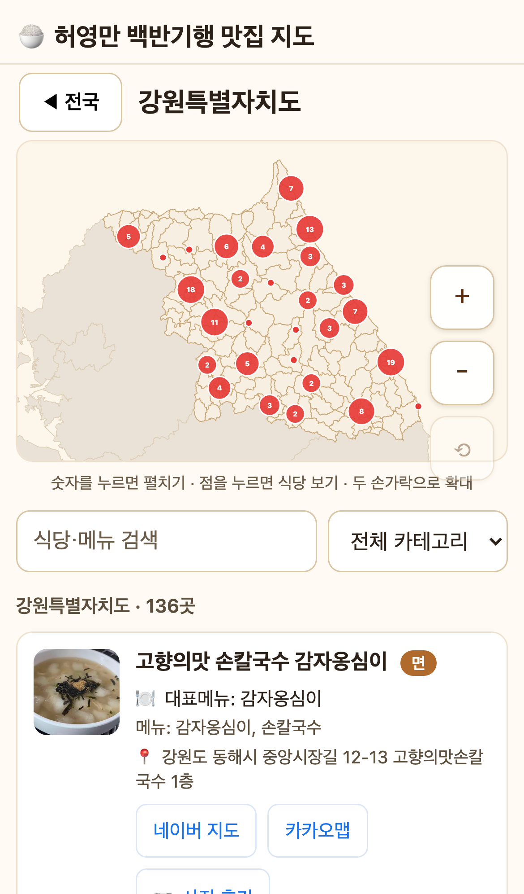

# 🍚 허영만 백반기행 맛집 지도

TV조선 《식객 허영만의 백반기행》에 나온 **전국 맛집 1,157곳**을 남한 지도에서 지역별로 탐색하는 웹앱입니다.

### 🔗 **[baekbangihaeng-map.vercel.app](https://baekbangihaeng-map.vercel.app)**

> 팬 제작 비상업 프로젝트 · 데이터 출처: [다이닝코드](https://www.diningcode.com) · 프로그램: TV조선 「식객 허영만의 백반기행」

## 미리보기



| 지역 지도 + 리스트 (데스크톱) | 모바일 |
| :---: | :---: |
|  |  |

*지도의 숫자는 클러스터(맛집 수) — 누르면 펼쳐지고, 카드에서 사진·주소·지도 링크로 이동*

---

## 주요 기능

- **지도 탐색** — 전국 지도에서 시/도를 누르면 그 지역 맛집이 지도 위에 표시. 밀집 지역은 **개수 배지 클러스터**로 묶이고, 누르면 부채꼴로 펼쳐(스파이더파이) 개별 선택
- **식당 카드** — 대표 음식 사진, 대표메뉴·메뉴, 주소, 네이버 지도 / 카카오맵 / 사진·후기 링크
- **카테고리 필터** — 카테고리를 고르면 지도 카운트가 그 카테고리 기준으로 갱신
- **전역 검색** — 이름·메뉴로 전국 검색 (지역·카테고리와 독립)
- **모바일 최적화** — 큰 터치 타겟, 핀치 줌/팬, 지도-리스트 공존 레이아웃, 브라우저 뒤로가기 지원(전국↔시도↔식당), 외부 링크 같은 탭 이동 + 지역 URL 복원

## 데이터

- 다이닝코드 검색 API를 250개 시/군/구 + 17개 시/도 단위로 훑어 "식객허영만의백반기행" 태그 식당을 전수 수집(중복 제거)
- 각 식당: 이름 · 도로명 주소 · 정확한 위경도 · 카테고리 · 사진 · 다이닝코드 링크
- 좌표-시도 경계 정합성 검증: 98.6%가 배정 시/도 경계 내 (나머지는 해안/항구 단순화 경계 밖)

## 기술 스택

React 18 · TypeScript · Vite · d3-geo · zustand · Vitest / Playwright

지도 경계: [southkorea-maps](https://github.com/southkorea/southkorea-maps) (통계청 2018) TopoJSON

## 개발

```bash
npm install
npm run dev          # 개발 서버 (http://localhost:5173)
npm test             # 단위·컴포넌트 테스트 (Vitest)
npm run e2e          # E2E 스모크 (Playwright)
npm run build        # 프로덕션 빌드
```

### 데이터 재생성

```bash
# scripts/raw/ 에 southkorea-maps TopoJSON 3개가 있어야 함
npm run build:geo            # 경계 → public/geo (시도/시군구/읍면동 + 라벨 위치)
npm run fetch:diningcode     # 다이닝코드 전수 수집 → scripts/raw/diningcode.json
npm run normalize:diningcode # 정규화 → public/data/restaurants.json
npm run validate:data        # 스키마·좌표 bbox 검증

# 또는 한 번에:  npm run data
```

## 디렉토리

```
src/
  components/   MapNational, MapProvince(클러스터·스파이더파이·팬줌), RestaurantPanel, RestaurantCard, Filters, ErrorBoundary
  geo/          projection, cluster, usePanZoom, useGeo
  lib/          sido, addressParser, mapLinks, categories, filter(술어), koreaBounds, asset
  store.ts      zustand (지역·선택·필터 + 셀렉터)
  navigation.ts History API 동기화 + URL 지역 상태
scripts/        build-geo, fetch-diningcode, normalize-diningcode, validate-data, verify-regions
public/geo/     시도/시군구/읍면동 GeoJSON
public/data/    restaurants.json (1,157곳)
docs/screenshots/  README 이미지 · docs/superpowers/ 설계 문서
```

### 구조 원칙

- **레이어 import 방향 단방향** — `lib/`(순수 도메인: 타입·상수·술어)는 UI/상태를 import하지 않음. `store`·`components`가 `lib`을 소비 (순환 의존성 0, madge 검증)
- **비즈니스 정책 단일 출처** — 카테고리(`categories.ts`), 시/도 정규화(`sido.ts`), 필터 술어(`filter.ts`), 좌표 경계(`koreaBounds.ts`)를 각 한 곳에서 정의·재사용
- **YAGNI** — 실제 파이프라인(다이닝코드)에서 쓰지 않는 코드는 두지 않음

## 면책

본 프로젝트는 개인 팬이 만든 비상업 참고용입니다. 식당 정보(위치·메뉴·영업 여부 등)는 변경될 수 있으니 방문 전 네이버/카카오 지도로 확인하세요. 저작권·상표는 각 권리자에게 있습니다.
